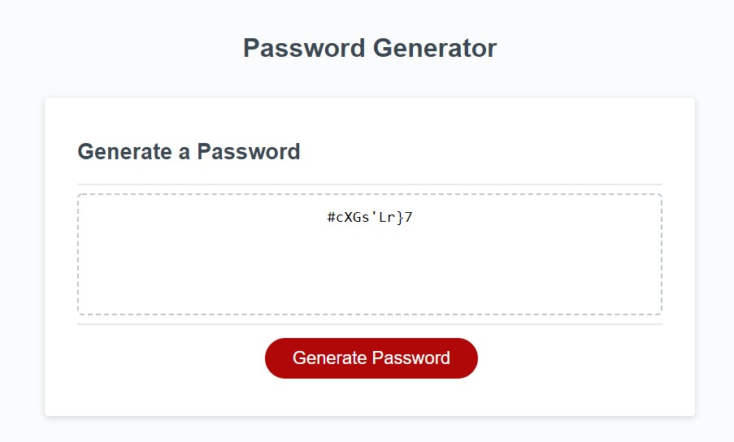

# Javascript: Password Generator

The following Javascript code was created by [Juan Jose Ramirez](https://github.com/JuanjoRamirez262/password-generator), using an existing html and CSS template granted by UW Bootcamp.

## Introduction

This code its a solution to the common exercise of generating a randomize password with some restrictions.

In this document you'll find an small explanation to the problem, the algorithm that I created to solve it, and the functions used to solve it.

## The problem: Password Generation

The idea of this code, its to create an algorithm that give us a randomize password, with some restrictions. Those restrictions are the following ones:

1. The password must be generated randomly.
2. The password must contain between 8 and 128 characters, choose by the user.
3. The user must decide if the password contains lower case character, upper case character, numeric characters and/or special characters. 
4. If step 2 or 3 is not fulfilled, the user should be asked to enter them again.
5. The generated password must match the selected criteria.

## The solution (Algorithm)

For practical effects of the problem, we will ignore the operation of HTML and CSS and go directly to the operation of the code in Javascript.

In Javascript, there is a button that contains an EventListener. This button call the function called `writePassword`, and this call `generatePassword()`. Here is were the algorithm start.

The function `generatePassword()` starts asking the user the lenght of the of the password. This is done through the function `setPasswordLenght()`, which uses a prompt window to ask the user for the lenght. At the same time, this function is in charge of verifying that the length entered and the type of response entered are correct. If they are not, it ask again.

Once the lenght was entered correctly, the user will be asked what type of characters they want their password to contain. This is going to be done by the functions `setLowerCaseCharacter()`, `setUpperCaseCharacter()`, `setNumericCharacter()` and `setSpecialCharacter()`, that through a confirm window will ask the user a yes or no question, saving the result as a boolean variable. If all the aswers were `false`, the function `generatePassword()` will repeat this process untill at least one its `true`.

Knowing the conditions of the new password, the function `concatCharacterArray(lower, upper, numeric, special)` will concate in a new array, all the possibles character that the password could contain. This array is going to be receive by the function `pickCharacters(posibbleArray, resultLenght)`, and knowing the possibles characters and the lenght of the password, its going to pick randomly as many characters as the password may contain. This array is going to be the candidate to password, but to be the final password, it must first be approved by the function `checkPasswordConditions(possiblePassword, lowerCaseCharacter, upperCaseCharacter, numericCharacter, specialCharacter)` which is going to check if all the conditions are been complete. If its not, then the function is going to call again the function `pickCharacters(posibbleArray, resultLenght)` until a password meets all conditions. By converting this array into string, using the method `.join('')`, this is going to be the final password, and the return of the function `generatePassword()`.

Finally, the password is going to be displayed in the document.

Here is an example of the code working.

## Repository and live URL to code

[Github](https://github.com/JuanjoRamirez262/password-generator)

[Github page](https://juanjoramirez262.github.io/password-generator/)

### Author notes

Thanks for taking the time to check this document, you rock!

As you can notice, I'm a not native English speaker. Is there is some mispelled word, I'm sorry... I'm still learning English :)